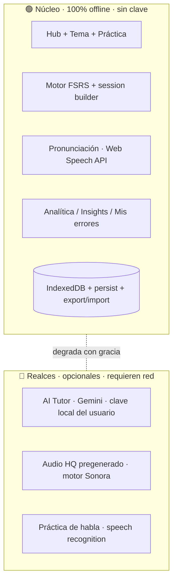

# Momentum — Diseño (spec)

> **Momentum** — *"Sigue el impulso."*
> App personal, offline-first, para aprender inglés a partir de un corpus de guías de gramática de alta calidad. Hub navegable + práctica activa con repaso espaciado, **con capas opcionales de audio y tutor de IA**. PWA instalable que funciona sin conexión.

- **Fecha:** 2026-09-23
- **Autor:** Edgar Mora (con Claude)
- **Estado:** Diseño en revisión final (ampliado para robustez: audio + AI Tutor + analítica). Pendiente aprobación del spec antes del plan de implementación.

---

## 1. Objetivo y contexto

Convertir ~30 guías de gramática en PDF (≈400+ páginas, bilingües EN/ES, muy bien diseñadas) en una **experiencia de estudio interactiva, robusta y de alto valor**: fácil de estudiar, con retención real, agradable de abrir cada día, y completa como material.

**Aprendiz:** hispanohablante, nivel A2 según prueba de la academia, en fase de *afianzar y crecer*. Requisito explícito: **no encasillar por nivel** — el material va de lo accesible a temas B2/C1; la app parte de fundamentos pero deja todo abierto y adapta la dificultad por ítem.

**Uso:** celular y computadora por igual; el **núcleo debe funcionar offline**.

**Éxito se ve como:**
- Estudiar en sesiones cortas (≈6–8 min) desde celular o compu, sin conexión, con retención medible.
- Cada tema del corpus es consultable (hub), practicable (retrieval + repaso espaciado) y **escuchable** (pronunciación).
- El progreso se guarda solo, sin backend, es respaldable, y motiva a volver (racha/hábito, no scoreboard).
- Experiencia visual de alto impacto que no cansa en sesiones largas.
- Cuando hay red y el usuario lo activa, un **tutor de IA** amplía explicaciones y práctica — pero **nunca es obligatorio**.

**No-objetivos (YAGNI):** cuentas de usuario, backend obligatorio, sync automático multi-dispositivo en v1 (se usa export/import manual), IA obligatoria u online-only, generación de contenido en runtime como única fuente, comunidad/social, notificaciones push confiables (limitación de plataforma).

---

## 2. Arquitectura en capas (clave del diseño)

La robustez se logra separando **núcleo offline** de **realces opcionales online**. El núcleo jamás depende de la nube; los realces se encienden con gracia si hay red (y, para IA, clave del usuario) y se apagan sin romper nada.



- **Núcleo:** hub navegable, práctica retrieval-first, repaso espaciado (FSRS), pronunciación TTS del navegador, analítica, y almacenamiento local. Todo offline.
- **Realces (opcionales):** AI Tutor (Gemini), audio HQ pregenerado, práctica de habla. Detección de disponibilidad (online/clave/soporte del navegador) → si no hay, la UI oculta o desactiva el realce sin errores.

---

## 3. Formato de entrega — decisión crítica

Tras revisión crítica: **un único HTML autocontenido no escala** para el corpus completo + diagramas + audio (varios MB, carga lenta). Decisión:

- **App = PWA con app-shell** (HTML/CSS/JS del motor) **+ contenido por módulo cargado bajo demanda** (`content/<módulo>.json` y assets), **todo cacheado por el service worker** → funciona offline tras la primera visita, e instalable ("Add to Home Screen").
- Se mantiene un **build "single-file" opcional** (inyecta un módulo + assets en un `.html`) para portabilidad/respaldo y para la demo de la rebanada vertical.
- **Diagramas** como assets cacheados (PNG/SVG), **no** base64 inline, para no inflar el shell.

Esto cambia el "un solo archivo" inicial a favor de la robustez pedida, conservando la portabilidad como opción.

---

## 4. Principios de aprendizaje (evidencia → implementación)

Base: retrievalpractice.org, learningscientists.org, FSRS/Anki, Duolingo eng-blog, NN/g. Cada principio es requisito:

1. **Retrieval practice (efecto de prueba).** El ítem *pregunta primero* y revela después; nunca "voltear tarjeta" pasivo.
2. **Repaso espaciado (FSRS).** Cada ítem se agenda con `ts-fsrs` (stability/difficulty/retrievability por ítem), 100% en el navegador.
3. **Interleaving.** Las sesiones **mezclan** ítems vencidos de varios módulos, no un tema a la vez.
4. **Dual coding.** Se conservan diagramas/infografías del corpus, adjuntos a cada tema/ítem, **+ audio** (triple ruta: texto/visual/sonido).
5. **Comprehensible input (i+1).** Ejemplos cercanos al nivel, seguidos de una tarea de producción.
6. **Feedback inmediato y calibrado.** Tras cada intento: respuesta + "porqué" de una línea; la calificación alimenta al FSRS.

---

## 5. UX de microaprendizaje

- **3–6 ítems por pantalla**; una idea a la vez; líneas cortas.
- Sesiones **cortas y completables**.
- **Feedback justo después de cada respuesta**.
- **Gamificación como hábito** (tarjetas de hoy, racha de repaso), **nunca** scoreboard de puntos/insignias/ranking.
- **Dificultad la decide el SRS** por ítem; ritmo de ítems nuevos configurable (defecto 8/día) para no saturar en A2.
- **Onboarding** de primer uso: explica *por qué* recordar cuesta y por qué eso es bueno (para confiar en el método), y activa el ritmo de estudio.

---

## 6. Concepto de producto (vistas)

- **Hub (inicio):** 6 módulos con anillos de progreso, buscador global, CTA "Practicar lo de hoy (N ítems · ~X min)", racha y meta diaria.
- **Tema (lección):** explicación bilingüe limpia + diagrama + **botón de audio** (oír ejemplos) + "Practicar este tema"; marcadores y notas personales.
- **Práctica:** flujo retrieval-first → respuesta → feedback + porqué + diagrama + audio → calificación → FSRS reagenda → siguiente. Modo mixto (interleaving) o por tema.
- **Insights:** retención, ítems dominados, pronóstico de repasos, **áreas débiles** y **"Mis errores"** con sesión de refuerzo dirigida.
- **Ajustes:** tema claro/oscuro, idioma de UI, ritmo de nuevos, audio, **AI Tutor (clave + provider)**, respaldo/persistencia.

**Módulos (agrupación del corpus):**

| Módulo | Contenido | Color de acento |
|---|---|---|
| ⏱ Sistema de tiempos | Present · Past · Future masterclasses (+ Passive por tiempos) | Índigo `#6366F1` |
| 🔀 Condicionales | Complete Guide · Optional Extension · timeline visual | Violeta `#8B5CF6` |
| 🧱 Estructura de la oración | Modifiers · Adjectives/Adverbs · Adjective Order · Comparatives ×2 · Relative Clauses · Prepositions · Connectors | Turquesa `#2DD4BF` |
| 🔧 Formas verbales especiales | Modals · Gerunds (-ING) · Passive · Reported Speech · GET · FOR vs TO · Haber | Cielo `#38BDF8` |
| ✍️ Mecánica y escritura | Punctuation · Contractions · Silent Letters · Numbers · Dates | Esmeralda `#10B981` |
| 💬 Inglés funcional | Directions | Ámbar `#F59E0B` |

---

## 7. Modelo de contenido (esquema)

```jsonc
// content/<módulo>.json (validado por esquema, cargado bajo demanda)
{
  "version": 1,
  "module": {
    "id": "tenses",
    "title": { "en": "Tense system", "es": "Sistema de tiempos" },
    "accent": "#6366F1",
    "topics": [
      {
        "id": "present-system",
        "title": { "en": "The present system", "es": "El sistema del presente" },
        "source": "Present tense masterclass.pdf",
        "explanation": [ /* bloques: párrafo EN/ES, tabla, callout, cita */ ],
        "diagrams": [ "assets/present-windows.png" ],
        "audio": { "voice": "en-US" },        // TTS por defecto; opcional ruta a audio HQ
        "examples": [ { "en": "...", "es": "..." } ],
        "related": ["past-perfect"],           // enlaces para construir esquema mental
        "items": ["itemId1", "itemId2"]
      }
    ],
    "items": [
      {
        "id": "itemId1",
        "topic": "present-system",
        "type": "cloze",              // cloze | choice | natural | order | match
        "prompt": { "en": "She ___ (work) here since 2020.", "es": "..." },
        "answer": "has worked",
        "accept": ["has worked", "'s worked"],  // variantes válidas (normalización)
        "distractors": ["works", "worked", "is working"],
        "why": { "en": "Duration up to now → present perfect.", "es": "Duración hasta ahora → present perfect." },
        "tags": ["present-perfect", "duration"]
      }
    ]
  }
}
```

- **Estado SRS por ítem** (stability, difficulty, due, reps, lapses) vive en IndexedDB, referenciado por `item.id` → actualizar contenido no borra progreso. Si un `id` cambia, migración por mapa.
- Tipos derivados del corpus: **cloze**, **choice**, **natural** ("¿cuál suena más natural?"), **order**, **match**.

---

## 8. Pipeline de contenido (PDF → interactivo)

1. `pypdf` extrae texto por tema.
2. Script estructura al esquema (detecta tablas bilingües, secciones, ejercicios existentes "Choose"/"which sounds more natural", errores marcados `❌`/`⚠`).
3. **Curación (Claude):** limpiar artefactos, redactar `why`, elegir **distractores realistas** (desde errores comunes del corpus), definir `accept`.
4. **Diagramas:** exportar páginas/infografías a PNG/SVG (requiere `poppler`; instalar en el entorno), guardar como assets cacheados.
5. **Validación de esquema** antes de aceptar el módulo.

Parte mecánica y escalable: se prueba en el primer módulo y se repite por cada uno.

---

## 9. Motor de práctica + repaso espaciado

- **Scheduler:** `ts-fsrs` (MIT). `createEmptyCard()` al introducir; `scheduler.next(card, now, rating)` al calificar; se persiste el card (JSON) en IndexedDB.
- **Calificación:** 4 botones FSRS → *Otra vez · Difícil · Bien · Fácil* (atajos de teclado en compu).
- **Session builder:** selecciona **vencidos** (`due <= now`) de todos los módulos, **intercala** por tipo/tema, inserta hasta *N* **nuevos**/día (defecto 8), tope ≈10–15 ítems, 3–6 por pantalla. Modo "tema" filtra por `topic`.
- **Respuestas escritas:** normalización (minúsculas, espacios, apóstrofes, contracciones) + lista `accept`; feedback tolerante a variantes válidas.
- **Sin muros por nivel:** orden de introducción parte de fundamentos, pero todo accesible; el FSRS adapta por ítem.

---

## 10. Audio (pronunciación)

- **Base (núcleo, offline, gratis):** **Web Speech API `speechSynthesis`** — toca cualquier ejemplo/palabra para oírlo con las voces del SO. Selección de voz/velocidad en Ajustes. Degrada con gracia si el navegador no tiene voces.
- **Realce (opcional):** **audio HQ pregenerado** para un set curado de frases clave, producido con el **motor de Sonora** (TTS intercambiable ya existente del usuario) y cacheado como assets. Se usa si está presente; si no, cae a TTS del navegador.
- **Futuro:** **práctica de habla** con `SpeechRecognition` (repite la frase; compara) — alinea con la meta *speaking-first* del usuario; online (Chrome).

---

## 11. AI Tutor (capa online opcional, provider-pluggable)

- **Objetivo:** ampliar el estudio cuando hay red — **no** es requisito.
- **Provider:** **Gemini por defecto** (como pidió el usuario), tras una interfaz `AITutorProvider` intercambiable (permite otros modelos después).
- **Clave:** el usuario **pega su propia API key**; se guarda **local** (IndexedDB), se usa directo desde el navegador. Personal, un solo usuario, un dispositivo.
  - ⚠️ **Seguridad:** una clave en cliente es visible en ese dispositivo; aceptable para uso personal. Si algún día se comparte la app, se requerirá un **mini-proxy** que custodie la clave (queda documentado como camino, no v1).
- **Funciones (todas degradan con gracia si no hay red/clave):**
  - **Explícame más:** re-explica un tema/ítem a mi nivel, con ejemplos nuevos.
  - **¿Por qué fallé?:** analiza mi respuesta escrita y explica el error.
  - **Genera práctica:** crea ítems extra del tema (revisados por el esquema antes de guardarse).
  - **Chat de práctica:** conversación guiada sobre el tema (y, con audio+habla, práctica hablada — futuro).
- **Diseño defensivo:** timeouts, manejo de error/cuota, aviso claro de estado, y **cero llamadas** sin acción explícita del usuario.

---

## 12. Identidad visual — Momentum

**Paleta (base oscura serena + acentos vivos; alto impacto, baja fatiga):**

| Rol | Hex | Nombre |
|---|---|---|
| Base / fondo | `#0F172A` | tinta noche |
| Superficie / tarjetas | `#1E293B` | pizarra |
| Primario | `#6366F1` | índigo |
| Éxito / acierto | `#10B981` | esmeralda |
| Racha / energía (uso mínimo) | `#F59E0B` | ámbar |
| Error / "otra vez" | `#F43F5E` | rosa-rojo suave |
| Texto principal | `#F8FAFC` | casi blanco |
| Texto secundario | `#94A3B8` | gris pizarra |

- **Acentos de módulo** (§6) como toques sobre superficies oscuras, con **contraste AA** y **siempre con ícono/etiqueta** (nunca color solo).
- **Modo claro opcional** (día): fondo `#F8FAFC`, texto `#0F172A`, acentos a contraste AA. Default oscuro; toggle recordado.
- **Tipografía:** `Inter` (fallback `system-ui` offline); jerarquía marcada, mucho aire.
- **Componentes:** tarjeta de práctica, anillo de progreso, chip de racha, píldora de módulo, callout bilingüe (EN/ES lado a lado / apilado en móvil), tabla responsive, botón de audio, panel de insights.
- **Movimiento:** transiciones sutiles; respeta `prefers-reduced-motion`.
- **Accesibilidad:** contraste AA, foco visible, teclado completo, `aria-label`s, no depender de color solo, targets ≥44px.

---

## 13. Datos, offline y seguridad del progreso

- **Service worker** cachea app-shell + contenido de módulos visitados + assets → offline tras primera carga; instalable.
- **IndexedDB** (async, esquema versionado con `onupgradeneeded`): estado SRS por ítem, historial de sesiones, racha, marcadores, notas, ajustes (idioma, tema, ritmo, voz, clave IA en local — sin cifrado real posible en cliente).
- **Persistencia:** solicitar `navigator.storage.persist()` para evitar que el navegador (p. ej. Safari) purgue datos.
- **Respaldo:** **export/import JSON** de todo el progreso (backup y traspaso manual celular↔compu) + **recordatorio periódico** de respaldar.
- **Tradeoff aceptado (v1):** sin sync automático; progreso por dispositivo + export/import. Sync (archivo en iCloud/Drive o backend opcional) queda a futuro.
- **Límites de plataforma (honesto):** iOS restringe notificaciones/almacenamiento en PWA; `speechSynthesis` varía por SO. La app detecta y degrada.

---

## 14. Rollout del contenido (corpus completo, módulo por módulo)

Se construye **todo** el corpus, incrementalmente, sobre el motor + capas ya probados.

1. **⏱ Sistema de tiempos** — *rebanada vertical v1*: motor completo (núcleo) + audio TTS + analítica + este módulo de punta a punta, **empezando por Present tense**; luego Past, Future, Passive-por-tiempos. (AI Tutor y audio HQ se integran como realces en esta misma fase, detrás de flags.)
2. **🔀 Condicionales** (incluye el timeline visual).
3. **🧱 Estructura de la oración.**
4. **🔧 Formas verbales especiales.**
5. **✍️ Mecánica y escritura.**
6. **💬 Inglés funcional.**

Del módulo 2 en adelante es principalmente trabajo de contenido.

---

## 15. Estrategia de pruebas (TDD)

- **Contenido:** todo ítem con `type` válido, `answer`, `why`; referencias `topic`/`item`/`related` resuelven; `accept` incluye la `answer`.
- **Engine (unit):** transiciones FSRS por calificación; session builder (vencidos, interleaving, tope, ritmo de nuevos); normalización de respuestas; store IndexedDB (CRUD, versionado, migración de ids); round-trip export/import.
- **Capas (graceful degradation):** con red/clave ausentes, AI Tutor y audio HQ se ocultan/desactivan sin error; TTS ausente cae a texto.
- **PWA/offline:** app carga y practica sin red tras primera visita (prueba con service worker).
- **UI (smoke):** render de las vistas; flujo de una tarjeta (pregunta→feedback→calificación→siguiente).
- **Manual:** UX en celular real + compu; modo avión; contraste/accesibilidad; prueba de una llamada real al AI Tutor con clave del usuario.

---

## 16. Preguntas abiertas / futuro

- **Sync automático** multi-dispositivo (archivo en la nube o backend/proxy — este último también resolvería la custodia de la clave IA).
- **Práctica de habla** (speech recognition) y conversación hablada con el AI Tutor — meta *speaking-first*.
- **Audio HQ** para todo el corpus (no solo set curado) vía Sonora.
- **Diagnóstico inicial opcional** para sembrar el FSRS sin etiquetar nivel.
- **Notificaciones/recordatorios** dentro de los límites de plataforma.
